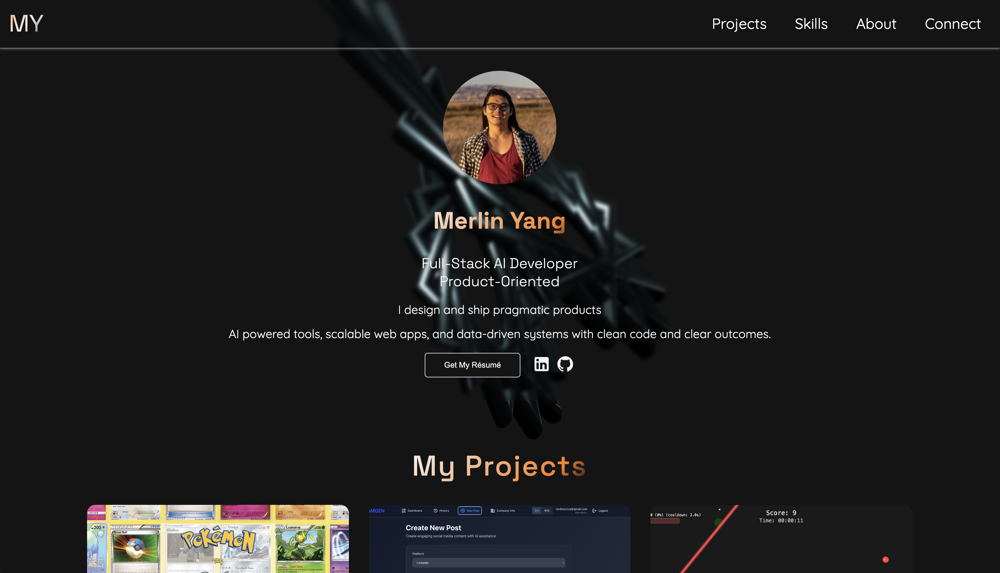

# Merlin Yang's Portfolio

A clean, interactive portfolio showcasing web development projects with 3D graphics and responsive design.

## Screenshot




## Features

- **Interactive 3D background** using Three.js
- **Dynamic project grid** with live project cards
- **Skills showcase** with tech stack icons (AI/ML, Frontend, Backend)
- **Responsive navigation** with mobile menu
- **About page** with personal and technical background
- **Smooth animations** and modern UI

## Tech Stack

**Frontend:**

- HTML5, CSS3, JavaScript (ES6+)
- Three.js for 3D graphics
- Google Fonts (Quicksand, Space Grotesk)
- Material Symbols for icons

**Libraries:**

- `three` (v0.180.0) - 3D rendering
- `tech-stack-icons` (v3.3.2) - Tech logos

**Deployment:**

- Vercel (static site)

## Installation

```bash
# Clone the repository
git clone https://github.com/merlinymy/portfolio_prototype.git
cd portfolio_prototype

# Install dependencies
npm install

# Open index.html in your browser
# Or use a local server (e.g., Live Server in VS Code)
```

## Usage

1. Open `index.html` in a browser
2. Navigate between sections using the header menu
3. Click project cards to view live demos or GitHub repos
4. Visit the About page for more background

## Project Structure

```
portfolio_prototype/
├── assets/
│   ├── projectsArray.js    # Project data
│   ├── skills.js            # Skills data with SVG icons
│   └── projectImg/          # Project screenshots
├── scripts/
│   ├── main.js              # Entry point
│   ├── canvas3d.js          # Three.js 3D scene
│   ├── projects.js          # Project grid renderer
│   ├── skillsGrid.js        # Skills grid renderer
│   └── menupop.js           # Mobile menu toggle
├── styles/
│   ├── styles.css           # Main styles
│   └── aboutStyles.css      # About page styles
├── public/
│   └── favicon.png
├── index.html               # Homepage
├── about.html               # About page
└── vercel.json              # Vercel config
```

## AI usage - Claude Code

- Study index.html and styles.css then apply the same style to about.html. You should only use the styles in styles.css

## AI usage - Model GPT-5

---

### Deployment / Hosting

- How do I rewind a commit from GitHub website?

---

### Frontend / Design

- Study my project grid styles and apply them to my skill grid.
- Should I use the same font across the page?
- I want to use Quicksand for 90% of text—what should I use for `h1` and `h2`?
- Do people usually put padding on the `body`?
- Should the hero section use `h2`? Can I use multiple `h2` for GSAP animations?
- Write me a better hero section using what you know about me.

---

### Content / Structure

- What are “user stories”?
- What does “above the fold” mean for featured projects?
- Base on what you know about me, create an about-me page. return html only. This About page should be both technical and personal (not too deep, for making friends). This About page should be complementary to index.html which I've provided below. The about page content should not include what index.html has

---

## Future Improvements

- [ ] Add blog section
- [ ] Implement dark mode toggle
- [ ] Add project filtering by tech stack
- [ ] Add contact form with backend integration
- [ ] Include case studies for featured projects

## License

MIT License - see [LICENSE](LICENSE) file for details.

---

© 2025 Merlin Yang. All rights reserved.
